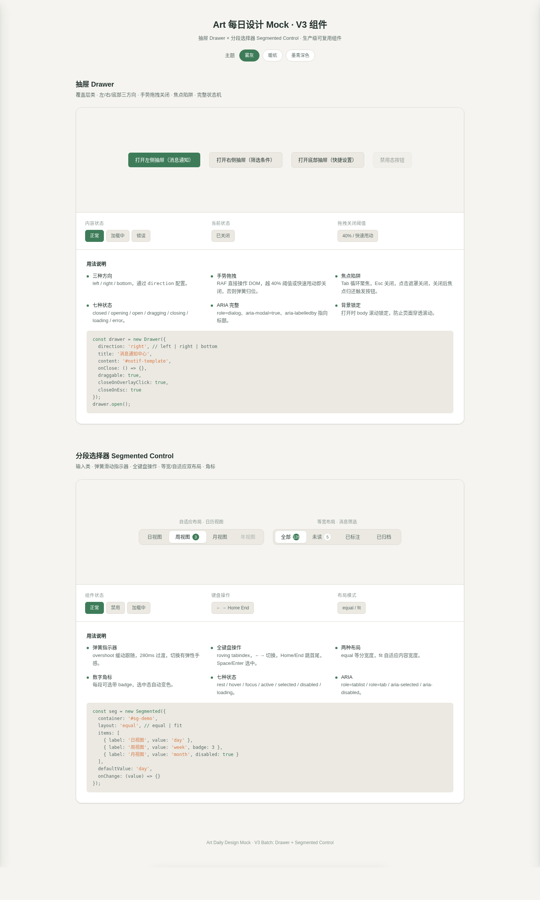

# 抽屉 Drawer + 分段选择器 Segmented Control

> Art 设计实验室 · V3 交互组件批次 · 2026-08-20
> 生产级可复用 UI 组件 · 纯 vanilla 单文件 · CSS 变量主题化



## 主题

一次产出两个真实项目最高频的 UI 积木——覆盖层类「抽屉 Drawer」与输入类「分段选择器 Segmented Control」。不是演示装置，是开发者 copy-paste 即可用的生产级组件。

**妙搭预览**：https://dcniaqwtmoca.feishu.cn/page/A5rsmuYeGd10ByaJnmlcGvLbnTc

## 简介

- **抽屉 Drawer**：左 / 右 / 底部三方向；手势拖拽关闭（40% 阈值 + 快速甩动双判定，未达阈值弹簧归位）；焦点陷阱 + Esc + 遮罩点击关闭；背景滚动锁定；关闭后焦点归还触发按钮；含 loading 骨架与 error 重试态。
- **分段选择器 Segmented Control**：弹簧滑动指示器（带 overshoot）；等宽 / 自适应双布局；方向键 / Home / End 全键盘；单段禁用；数字角标；loading 脉冲态。

展示页 `index.html` 含两个组件分区、状态演示控制台、三套主题切换、用法说明。

## 截图


## 文件说明

| 文件 | 说明 |
|---|---|
| `index.html` | 综合展示页（两组件 + 控制台 + 主题切换 + 用法文档） |
| `drawer.html` | 抽屉组件独立可抽取文件（`dr-` 命名空间，自包含 CSS+JS） |
| `segmented-control.html` | 分段选择器组件独立可抽取文件（`sg-` 命名空间，自包含 CSS+JS） |
| `设计规范.md` | 色值、字体、动效系统、状态机、CSS 变量清单 |
| `preview.png` | 展示页截图 |
| `README.md` | 本文件 |

## 用法文档

### 抽屉 Drawer

1. 复制 `drawer.html` 中的 `<style>` 与 `<script>` 段到你的项目，或整文件引入。
2. HTML 结构：触发按钮（`dr-trigger`）+ 抽屉容器（`dr-drawer dr-drawer--left|right|bottom`）+ 遮罩（`dr-overlay`）+ 内容区（`dr-content`）。
3. JS：`new Drawer(el, { direction, onOpen, onClose })`，或用 `data-dr-trigger` / `data-dr-close` 声明式绑定。

**可配置项（CSS 变量，`dr-` 前缀）**：

```css
:root {
  --dr-width: 380px;            /* 抽屉宽度（底部方向为高度） */
  --dr-radius: 16px;            /* 圆角 */
  --dr-duration: 280ms;         /* 滑入时长 */
  --dr-ease-spring: cubic-bezier(0.34, 1.56, 0.64, 1); /* 弹簧曲线 */
  --dr-overlay-color: rgba(26,35,32,.45);
  --dr-handle-color: #B8B4A8;
  /* 主色/底色等继承自全局 --accent-* / --bg-* */
}
```

**状态机**：closed / opening / open / dragging / closing / loading / error，触发按钮含 disabled。

**无障碍**：`role=dialog` `aria-modal` `aria-labelledby`；Tab 焦点陷阱；Esc 关闭；焦点归还。

### 分段选择器 Segmented Control

1. 复制 `segmented-control.html` 的 `<style>` 与 `<script>`。
2. HTML 结构：`sg-segmented` 容器（`sg-segmented--equal` 等宽 / `sg-segmented--fit` 自适应）+ `sg-segment` 段落（含 `sg-text` / `sg-badge`）+ `sg-indicator` 指示器。
3. JS：`new SegmentedControl(el, { onChange, disabled })`。

**可配置项（CSS 变量，`sg-` 前缀）**：

```css
:root {
  --sg-track-bg: var(--bg-subtle);
  --sg-segment-color: var(--text-secondary);
  --sg-indicator-bg: var(--bg-elevated);
  --sg-radius: 10px;
  --sg-font: var(--font-sans);
  --sg-ease-spring: cubic-bezier(0.34, 1.56, 0.64, 1);
}
```

**状态机**：rest / hover / focus / active / selected / disabled / loading。

**无障碍**：`role=tablist` + `aria-selected` + `aria-disabled`；roving tabindex；← → ↑ ↓ / Home / End / Space / Enter；焦点环可见。

## 定制方法

- **换主题**：根元素加 `data-theme="warm-paper"`（暖纸）或 `data-theme="ink-teal"`（墨青深色），或直接覆盖 `--accent-primary` / `--bg-base` 等全局变量。
- **换主色**：改 `--accent-primary`（hover/active 联动），其余语义色自动跟随。
- **改手感**：调 `--dr-ease-spring` / `--sg-ease-spring` 与 `--dr-duration`；危险/确认类操作可加阻尼（换 `cubic-bezier(0.2,0,0,1)`）。

## 技术栈

- 纯 vanilla HTML + CSS + JS，单文件，零外部依赖（无 React / Babel / CDN / 外部字体）。
- RAF / 定时器随 `document.visibilitychange` 暂停，组件卸载时取消。
- 高频指针事件直接操作 DOM（拖拽跟随不走重渲染）。
- `prefers-reduced-motion` 降级为线性 ≤200ms。
- 全中文 UI 文案，真实场景内容。

## 自查结论

- ✅ Browser QA：页面正常加载，无 Console Error / 404 / Uncaught，截图非空白（std 17.53）。
- ✅ 状态机：Drawer 7+ 态、Segmented 7 态，均覆盖 disabled/loading/error/focus。
- ✅ 键盘：焦点陷阱 + 方向键/Home/End + Esc，焦点环可见，aria-* 完整。
- ✅ 可复用：dr-/sg- 前缀命名空间，独立可抽取文件，CSS 变量 ≥36 个，三套主题。
- ✅ 删动画后功能仍完整；灰度下信息层级仍成立。
- ✅ 与历史组件作品无重复（Drawer / Segmented 均为首次产出）。

**Pipeline 结论**：Art Director 选定 → Designer 实现 → Browser QA PASS → Critic FULL（0 CRITICAL / 0 MAJOR / 1 MINOR）→ Quality Gate **PASS**。

> 等待协调者检查后提交 GitHub（本任务不执行 git 操作）。
