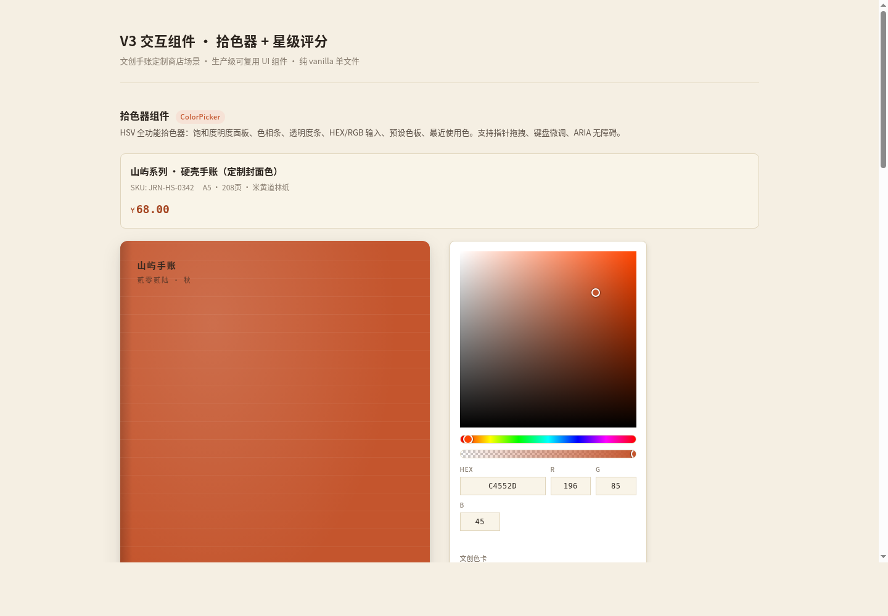

# 拾色与评分 · 文创手账定制商店（V3 交互组件）

> 形态：V3 实用可复用 UI 组件 · 纯 vanilla 单文件 · 当日一版

## 简介
两个生产级输入类 UI 组件，以「山屿硬壳手账定制商店」真实场景承载：
1. **HSV 拾色器**（`.cp-*`）——为手账封面选色，选色实时联动封面预览换色。
2. **星级评分**（`.rt-*`）——收货后为商品打分并提交评价。

二者状态机完整、键盘可操作、CSS 变量主题化、独立命名空间可整块抽取到任意项目复用。展示页克制，组件是主角。

## 截图


## 妙搭预览
https://dcniaqwtmoca.feishu.cn/page/G9EbmoJ6rdvP4uajsTVc1MR7nwf

## 组件一：拾色器（ColorPicker `.cp-*`）

### 功能
- SV（饱和度/明度）二维面板 + 色相条 + 透明度条
- HEX / RGB 输入框双向同步，非法 HEX 进入 error 态（aria-invalid + 抖动提示）
- 预设色板 + 最近使用色
- 选色实时联动「手账封面预览」换色

### 状态机
rest / hover / focus（焦点环） / active（拖拽中） / error（HEX 非法） — 5 态。

### 键盘
- SV 面板：方向键微调（Shift 大步长），`role="slider"` + `aria-valuenow/valuetext`
- 色相条 / 透明度条：←→ 微调、Shift 大步长
- HEX 输入：Tab 聚焦、Enter 确认、非法输入即时校验

### 主题变量
```
--cp-accent / --cp-accent-deep   主色
--cp-bg / --cp-panel / --cp-border / --cp-text / --cp-text-soft / --cp-text-mute
--cp-error / --cp-error-faint
--cp-radius / --cp-radius-s
--cp-duration / --cp-ease
```

## 组件二：星级评分（Rating `.rt-*`）

### 功能
- 整星 + 半星，hover 预览，点击选定带弹簧弹跳
- 必填校验：未选即提交进入 error 态（aria-invalid + 提示）
- 提交流：loading（aria-busy）→ success（对勾），可重置
- 支持只读 / 禁用态

### 状态机
rest / hover（半星预览） / focus / active / disabled / error / loading / success — 8 态。

### 键盘
- ←→↑↓ 增减 0.5 星、Home/End 归 0/满、数字键 0–5 快设、Enter 提交
- `role="radiogroup"` + `aria-checked`

### 主题变量
```
--rt-star-color / --rt-star-active / --rt-star-active-deep
--rt-bg / --rt-border / --rt-text / --rt-text-soft / --rt-text-mute
--rt-error / --rt-error-faint / --rt-success / --rt-success-faint
--rt-radius / --rt-duration / --rt-ease-spring / --rt-ease-standard
```

## 用法（抽取到其他项目）
1. 复制 `index.html` 中 `.cp-*` 与 `.rt-*` 对应的 `<style>` 段与 `<script>` 段到目标项目。
2. 在目标项目 `:root` 覆盖少量 CSS 变量（如 `--cp-accent`、`--rt-star-active`、`--cp-radius`）即可换皮，无需改组件内部代码。
3. 组件 JS 以构造函数暴露（参数可配置），调用后获得实例，实例提供 `destroy()` 清理监听与定时器。

## 可配置项 / 定制方法
- **换主色**：覆盖 `--persimmon` 或直接 `--cp-accent` / `--rt-star-active`。
- **换圆角/节奏**：覆盖 `--radius-m` / `--cp-duration` / `--rt-duration`。
- **降级动画**：用户系统开启「减少动态效果」时自动降级，无需配置。

## 文件说明
- `index.html` — 单文件实现（HTML + CSS + JS，纯 vanilla，无外部依赖）
- `preview.png` — 1440×1000 桌面端截图
- `设计规范.md` — 色值/字体/动效系统抽取说明
- `README.md` — 本文档

## 技术栈
纯 HTML + CSS + JavaScript（vanilla），无 React / Babel / CDN / 外部字体。支持 `prefers-reduced-motion`；RAF/定时器随页面可见性暂停并在卸载时取消。

## 设计阶段产物
- Art Director 5 候选与选择：`~/.aily/workspace/arc/memory/decisions/2026-08-20-v3-color-picker-rating-art-director.json`
- Design Contract：本任务 `artifacts/design-contract.md`
- Browser QA：chromium headless 渲染通过（截图像素 std 57.21，非空白；无 Console error；无外部依赖 404）
- Critic：Contract Fidelity = FULL；状态机/可访问性/复用/手感/可抽取六项达标，CRITICAL=0
- Quality Gate：**PASS**

> 等待协调者（心跳检查）质检通过后统一提交 GitHub，本任务不执行 git add/commit/push。
