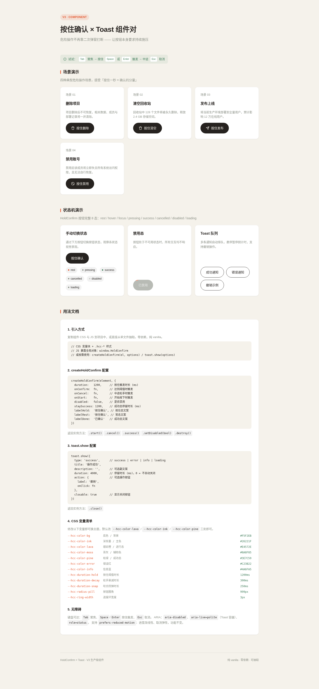
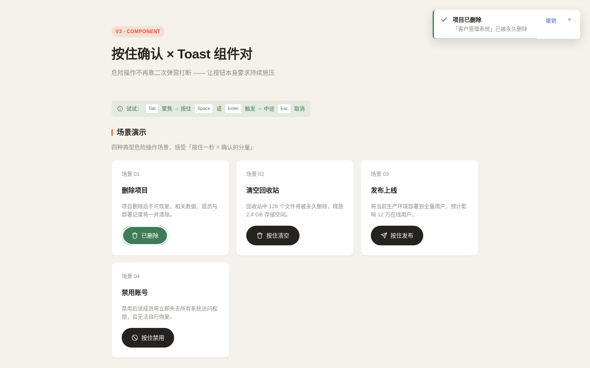

# 按住确认 × Toast 组件对

> V3 生产级 UI 组件 · 2026-08-20 · 类别：操作类 + 反馈类

## 简介

「确认的分量」——一套可直接搬到真实项目里的 **按住确认按钮（Hold-to-Confirm）+ 队列式 Toast 通知** 组件对。危险操作（删除/清空/发布/禁用）不再靠二次弹窗打断用户，而是让按钮本身要求持续施压：按住时进度环以阻尼曲线填充，填满瞬间弹性咬合确认；中途松手进度衰减归零，零误触。操作结果由 Toast 队列承接（成功/失败/可撤销），形成「施压确认 → 结果反馈」完整闭环。

组件只取「持续施压」的交互语义，不做闸刀/拉杆等拟物造型——是工程上可用的界面积木，不是物理演示装置。



按住触发后弹出的 Toast：



**妙搭在线预览**：https://dcniaqwtmoca.feishu.cn/page/Pjhqm8R1kd99eNaDlXBckTgsn5b

## 核心特性

- **Hold 按钮 8 态状态机**：rest / hover / focus / pressing / success / cancelled / disabled / loading
- **阈值语义手感**：默认按住 1200ms 触发；阻尼填充先快后慢，触发瞬间弹性咬合回弹，松手 300ms 衰减归零
- **键盘全可达**：Tab 聚焦 → 按住 Space/Enter 等效触发 → Esc 取消
- **Toast 队列**：4 种语义类型、排队、悬停暂停、撤销 action、手动关闭
- **CSS 变量主题化**：`--hcc-*` 前缀 12+ 变量，改 3 处色值即可换主题
- **工厂 API**：`createHoldConfirm(el, options)` / `toast.show(options)`
- **纯 vanilla 单文件**：无 React / Babel / CDN / 外部字体 / 图片，零依赖
- **prefers-reduced-motion 降级**：进度改线性、取消弹性，功能不变

## 用法

### 引入方式

纯 vanilla 实现，复制组件 CSS（`.hcc-*` 样式块）与 JS（`window.HoldConfirm` 对象）到任意项目即可。JS 暴露全局对象 `window.HoldConfirm`。

### createHoldConfirm 配置

```js
const inst = HoldConfirm.create(el, {
  duration: 1200,        // 按住触发时长(ms)
  onConfirm: () => {},   // 达到阈值时触发
  onCancel:   () => {},  // 中途松手时触发
  onStart:    () => {},  // 开始按下时触发
  disabled: false,       // 是否禁用
  staySuccess: 1200,     // 成功态停留时长(ms)
  labelHold: '按住确认', // 按住态文案
  labelRest: '按住确认', // 常态文案
  labelDone: '已确认'    // 成功态文案
});

// 实例方法
inst.start();            // 主动开始计时
inst.cancel();           // 主动取消
inst.success();          // 直接进入成功态
inst.setDisabled(true);  // 切换禁用
inst.destroy();          // 销毁，解绑事件
```

### toast.show 配置

```js
const t = HoldConfirm.toast.show({
  type: 'success',       // success | error | info | loading
  title: '操作成功',
  description: '',       // 可选副文案
  duration: 4000,        // 停留时长(ms)，0 = 不自动关闭
  action: {              // 可选操作按钮
    label: '撤销',
    onClick: () => {}
  },
  closable: true         // 是否显示关闭按钮
});
t.close();               // 手动关闭
```

## 可配置项（CSS 变量清单）

| 变量 | 默认值 | 说明 |
| --- | --- | --- |
| `--hcc-color-bg` | `#F5F2EB` | 页面底色 |
| `--hcc-color-ink` | `#26221F` | 深炭墨，主文字/按压重量 |
| `--hcc-color-lava` | `#E4572E` | 熔岩橙，危险/进行态进度环 |
| `--hcc-color-pine` | `#3E7C59` | 松绿，成功态 |
| `--hcc-color-moss` | `#8A8F85` | 苔灰，禁用/辅助 |
| `--hcc-color-error` | `#C23B22` | Toast 错误红 |
| `--hcc-color-info` | `#4A6FA5` | Toast 信息蓝 |
| `--hcc-duration-hold` | `1200ms` | 按住阈值时长 |
| `--hcc-duration-decay` | `300ms` | 松手衰减时长 |
| `--hcc-duration-snap` | `250ms` | 咬合回弹时长 |
| `--hcc-ease-damping` | `cubic-bezier(0.22,1,0.36,1)` | 阻尼填充曲线 |
| `--hcc-ease-snap` | `cubic-bezier(0.34,1.56,0.64,1)` | 弹性咬合曲线 |
| `--hcc-radius-pill` | `999px` | 按钮圆角 |
| `--hcc-ring-width` | `3px` | 进度环宽度 |

完整变量见 `index.html` 中 `:root` 块。换主题只需改 `--hcc-color-lava/ink/pine` 三处即可。

## 定制方法

1. **换主题色**：改 `--hcc-color-lava`（进行态）、`--hcc-color-pine`（成功态）、`--hcc-color-ink`（文字）三个变量。
2. **调触发时长**：同时改 `--hcc-duration-hold` 与 `createHoldConfirm` 的 `duration`（CSS 动画时长需与 JS 计时一致）。
3. **改触发文案**：通过 `labelHold/labelRest/labelDone` 配置项传入。
4. **接入异步操作**：`onConfirm` 中调用接口，成功调 `inst.success()`、失败调 `inst.cancel()` 或 `toast.show({type:'error'})`。

## 无障碍

- 键盘：Tab 聚焦、Space/Enter 按住触发、Esc 取消进行中的按压。
- 焦点环始终可见（`--hcc-focus-ring: 2px solid var(--hcc-color-ink)`）。
- `aria-disabled`、Toast 容器 `role=status` + `aria-live=polite`。
- `prefers-reduced-motion`：缓动降为 `linear`，取消弹性回弹，进度环仍线性填充。

## 文件说明

| 文件 | 说明 |
| --- | --- |
| `index.html` | 单文件实现（HTML + CSS + JS，可独立抽取） |
| `设计规范.md` | 配色 / 字体 / 动效系统 / 状态机 / 可访问性规范 |
| `preview.png` | 全页预览截图（1440px） |
| `preview-interaction.png` | 按住触发 Toast 交互截图 |
| `README.md` | 本文件 |

## 技术栈

纯 HTML + CSS + JavaScript（vanilla），零依赖，无构建步骤。直接用浏览器打开 `index.html` 即可运行。

## 抽取复用

把 `index.html` 中 `.hcc-*` 的 `<style>` 块与 `HoldConfirm` 对象的 `<script>` 块复制到目标项目，引入对应 DOM 结构（一个带 `.hcc-btn` 的按钮 + 一个 `.hcc-toast-container` 容器），调用 `createHoldConfirm` / `toast.show` 即可。改不超过 3 处 CSS 变量即可适配新主题。
