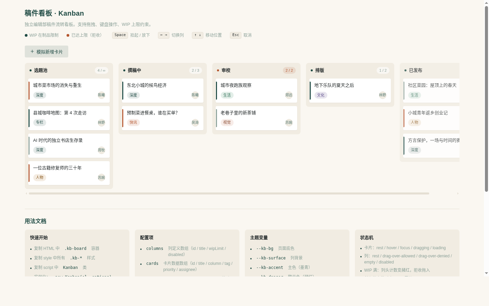

# 稿件流转看板 · Kanban Board

> 生产级 UI 组件 · V3 交互组件系列 · 2026-08-20

## 主题
实用可复用**看板组件**——卡片跨列拖拽 + 列级 WIP 上限 + 鼠标与键盘双通道完全对等。开发者 copy-paste 到自己项目（项目管理、内容流转、客服工单、招聘漏斗）即可立刻用起来。

## 简介
看板以「独立编辑部稿件流转」为真实场景：选题池 → 撰稿中 → 审校 → 排版 → 已发布五列。审校列 WIP=2 已满，用于演示「满列拒收」；已发布列为只读 disabled 列。卡片含标签、优先级色条、负责人缩写圆标。展示页顶部一行说明 + 图例 + 键盘提示，底部附用法文档，组件占绝对主角。

## 截图预览


桌面端（1440×900）完整看板渲染，五列流转、WIP 计数、disabled 只读列、用法文档区均正常。

## 妙搭在线预览
https://dcniaqwtmoca.feishu.cn/page/CGUNmAQL0dgRQ4aCZY6cpLKHnCe

## 核心能力
- **真实指针拖拽**：自实现 Pointer 拖拽，直接操作 DOM transform 跟手不掉帧；拾起浮起+微倾，目标列展开 placeholder 间隙预告落点，放下弹簧吸附
- **WIP 上限约束**：满列明确拒收（列头计数变赭红、间隙不出现、放下弹回+轻颤）
- **完整键盘流程**：Tab 聚焦 → Space/Enter 拾起 → ←→ 换列 → ↑↓ 移动位置 → Enter 放下 → Esc 取消
- **CSS 变量主题化**：22 个 `--kb-*` 变量，改变量即换肤
- **完整状态机**：卡片 rest/hover/focus/dragging/loading；列 drag-over-allowed/denied/empty/disabled

## 用法文档

### 快速开始
1. 复制 `index.html` 中的 `<style>` 段到你的项目样式表
2. 复制看板容器 `<div class="kb">...</div>` 到你的页面
3. 复制 `<script>` 段中的 `Kanban` 逻辑到你的脚本
4. 实例化：`new Kanban(el, { columns, cards, onMove })`

### 配置项
```js
{
  columns: [
    { id: 'topic', title: '选题池', wip: Infinity },
    { id: 'review', title: '审校', wip: 2 },
    { id: 'published', title: '已发布', disabled: true }
    // ...
  ],
  cards: [
    { id: 1, title: '...', tag: '深度', owner: '陈曦', priority: 'high', col: 'topic' }
  ],
  onMove: (card, fromCol, toCol, newIndex) => { /* 同步到后端 */ }
}
```

### 主题变量（节选）
```css
:root {
  --kb-bg: #FAF7F1;        /* 页面底 */
  --kb-surface: #F1ECE2;   /* 列背景 */
  --kb-accent: #1E4A43;    /* 主色/焦点环/计数 */
  --kb-danger: #B4552D;    /* WIP 满警示 */
  --kb-radius: 12px;
  --kb-duration: 200ms;
  --kb-ease-spring: cubic-bezier(0.34, 1.56, 0.64, 1);
}
```
完整 22 个变量见 `设计规范.md`。换肤只需改 `:root` 变量。

### 状态机
- 卡片：rest / hover / focus / dragging / loading
- 列：default / drag-over-allowed / drag-over-denied(WIP满) / empty / disabled

### 键盘操作
| 键 | 作用 |
|---|---|
| Tab | 聚焦卡片 |
| Space / Enter | 拾起 / 放下 |
| ← → | 切换目标列 |
| ↑ ↓ | 在列内移动位置 |
| Esc | 取消 |

## 文件说明
- `index.html` — 纯 vanilla 单文件组件（含展示页 + 用法文档区块）
- `设计规范.md` — 色值、字体、动效系统、状态机、配置项
- `preview.png` — 桌面端截图
- `preview/` — 多尺寸截图

## 技术栈
纯 vanilla 单文件（HTML + 内联 CSS + 内联 JS），无 React / Babel / CDN / 外部资源。系统字体栈。支持 `prefers-reduced-motion`。

## 复用说明
组件 HTML 段 + style 段 + script 段可独立抽取；复制到空项目后只改 CSS 变量即可换肤、改 JS 配置即可换内容，无需改动超过 3 处。
