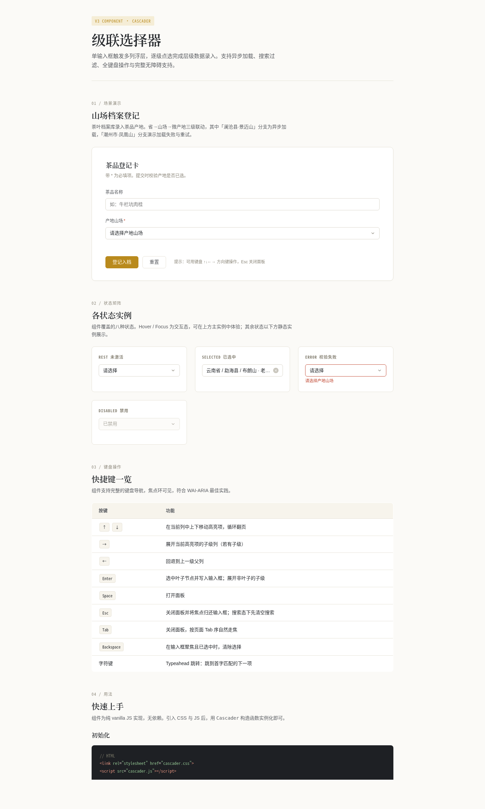

# 级联选择器 Cascader · 山场档案

> 2026-08-20 · V3 交互组件 · Art 设计实验室
> 妙搭预览：https://dcniaqwtmoca.feishu.cn/page/GSYYms2bGdfsMDat7i2couDHnHf



---

## 主题与简介

**级联选择器 Cascader** —— 单输入框触发多列浮层，逐级点选完成层级数据录入。

场景为「山场档案登记」：茶叶档案库录入茶品产地，省 → 山场 → 微产地三级联动。其中云南「澜沧县·景迈山」分支演示异步加载（展开 600ms 后落数据），广东「潮州市·凤凰山」分支演示加载失败与点击重试。这是真实项目高频组件（地址/分类选择），非物理演示装置。

**设计观点**：级联选择器的本质是一条被折叠的路径——输入框是路径容器，面板是路径的施工现场，每展开一级路径向前延伸一格。视觉采用「秋香金·墨色」配色，与近期暖纸+墨绿作品拉开差异。

---

## 截图展示


页面采用克制单栏文档式布局：页头 → 场景演示（山场档案登记卡）→ 状态矩阵（各状态静态实例）→ 键盘操作说明表 → 用法文档（初始化 / 配置项 / 实例方法 / CSS 变量表）。

---

## 用法文档

### 1. 引入

```html
<link rel="stylesheet" href="cascader.css">
<script src="cascader.js"></script>
```

```js
const cascader = new Cascader('#my-cascader', {
  data: [
    { value: 'fj', label: '福建省', children: [/* ... */] }
  ],
  placeholder: '请选择产地',
  searchable: true,
  onChange: (values, options) => {
    console.log(values);  // ['yn', 'mh', 'bl-lbz']
  }
});
```

### 2. 可配置项

| 参数 | 类型 | 默认值 | 说明 |
|---|---|---|---|
| `data` | Array | `[]` | 级联数据，结构为 `{value, label, children}` 嵌套 |
| `fetchChildren` | Function | `null` | 异步加载子级，签名 `(parentNode, callback) => void`，`callback(err, children)` |
| `searchable` | Boolean | `true` | 是否启用搜索框 |
| `placeholder` | String | `'请选择'` | 输入框占位文字 |
| `disabled` | Boolean | `false` | 是否禁用 |
| `clearable` | Boolean | `true` | 是否可清除 |
| `separator` | String | `' / '` | 路径分隔符 |
| `leafSeparator` | String | `' · '` | 叶子节点与父级的分隔符 |
| `fieldNames` | Object | `{label,value,children,isLeaf}` | 自定义字段名映射 |
| `onChange` | Function | `null` | 选中叶子时触发 `(values, pathOptions)` |
| `onSelect` | Function | `null` | 每级点击时触发 `(pathOptions, level)` |

### 3. 实例方法

| 方法 | 说明 |
|---|---|
| `.getValue()` | 获取选中的 value 数组 |
| `.getSelectedOptions()` | 获取选中的完整 option 对象路径 |
| `.clear()` | 清除选中项 |
| `.open()` / `.close()` | 打开 / 关闭面板 |
| `.setError(msg)` / `.clearError()` | 设置 / 清除错误态 |
| `.setDisabled(bool)` | 设置禁用状态 |
| `.setOptions(opts)` | 更新配置项 |
| `.destroy()` | 销毁实例，解绑事件与清空 DOM |

### 4. 定制方法（CSS 变量主题化）

组件暴露 40 个 CSS 变量，覆盖颜色 / 圆角 / 尺寸 / 阴影 / 时长 / 字体。在容器元素或 `:root` 上覆盖即可，无需改源码。完整清单见 `设计规范.md` 第 2 节，核心项：

```css
:root {
  --cs-accent: #B98A1D;        /* 主色 */
  --cs-error: #C0452F;          /* 错误色 */
  --cs-success: #4E7A4E;        /* 成功色 */
  --cs-bg: #FBFAF7;             /* 背景色 */
  --cs-ink: #24272B;            /* 主文字色 */
  --cs-border: #D9D5CA;         /* 边框色 */
  --cs-radius: 6px;             /* 圆角 */
  --cs-height: 36px;            /* 输入框高度 */
  --cs-duration: 160ms;         /* 动画时长 */
}
```

抽取到其他项目，改 3 处即可用：**数据源**（`data` / `fetchChildren`）、**主题变量**（`--cs-*`）、**挂载点**（选择器）。

---

## 状态机

覆盖 9 态：`rest` / `hover` / `focus`（焦点环可见）/ `open` / `selected`（路径回显 + 可清除）/ `loading`（列内 spinner）/ `empty`（搜索无结果）/ `error`（加载失败可重试 + 表单校验失败红框抖动）/ `disabled`。展示页状态矩阵陈列 rest / selected / error / disabled 四个静态实例，hover/focus 可在主实例体验，loading/empty/error（加载）通过展开异步分支与搜索触发。

### 键盘操作

| 按键 | 功能 |
|---|---|
| ↑ ↓ | 当前列上下移动高亮项，循环翻页 |
| → | 展开当前高亮项的子级列 |
| ← | 回退到上一级父列 |
| Enter | 选中叶子节点并写入输入框；展开非叶子的子级 |
| Space | 打开面板 |
| Esc | 关闭面板并将焦点归还输入框；搜索态下先清空搜索 |
| Tab | 关闭面板，按页面 Tab 序自然走焦 |
| Backspace | 输入框聚焦且已选中时清除选择 |
| 字符键 | Typeahead 跳转到首字匹配的下一项 |

---

## 文件说明

| 文件 | 说明 |
|---|---|
| `index.html` | 展示页（含山场档案演示场景 + 用法文档） |
| `cascader.css` | 组件样式（40 个 CSS 变量，`cs-` 命名空间，可独立抽取） |
| `cascader.js` | 组件核心逻辑（纯 vanilla，~1400 行，可独立抽取） |
| `设计规范.md` | 从源码提取的真实色值 / 字体 / 动效系统 / 状态机规范 |
| `preview.png` | 1440px 桌面端截图 |
| `README.md` | 本文件 |

> 组件 CSS / JS 与展示页用注释块 + `cs-` 前缀命名空间严格分区，展示页部分标注「抽取组件时可删除」。

---

## 技术栈

- 纯 vanilla HTML + CSS + JS，零运行时依赖
- ARIA：combobox + listbox + option + aria-expanded/activedescendant/selected/busy/live
- 定时器统一管理（同 key 先清后设，`visibilitychange` 隐藏时清空）
- `prefers-reduced-motion` 全量降级
- 字体：Noto Serif/Sans SC（`miaoda.feishu.cn` CDN，渐进增强，可去）

## 自查结论

- [x] Browser QA：1440px std=38.46 / 390px std=72.61 均非空白；console 无 Error；无横向溢出
- [x] Contract Fidelity：FULL（9 态状态机 / 全键盘 / ARIA 完整 / 40 CSS 变量 / 异步加载+失败重试 / 定时器管理 / reduced-motion 全部达成）
- [x] Quality Gate：PASS（Utility≈18 / State≈18 / Feel≈13 / Reuse≈13 / Tech≈9，CRITICAL=0）
- [x] 删掉所有动效功能仍完整；抽取改 ≤3 处可用
- [x] 禁蓝紫渐变 / 中文文案为主 / 真实数据（无 Lorem Ipsum）

等待协调者检查后提交 GitHub。
