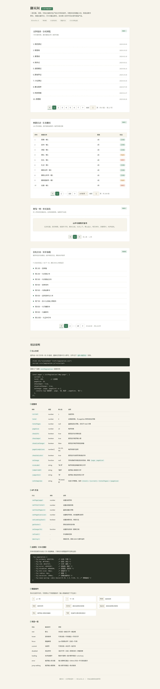

# 翻页间 · 分页导航组件

> Art 设计实验室 V3 · 交互组件系列 · 2026-08-20
> 类别：导航类 · Pagination

## 简介

一款优雅、克制、可独立抽取的生产级分页导航组件。页码如案头索引签条，当前页签条被抽出、染上竹青色，连续翻页时指示条以弹簧曲线连贯滑过。完整覆盖 8 态状态机，键盘全量可达，CSS 变量主题化，适合嵌入任何中后台或内容型产品。

**妙搭在线预览**：https://dcniaqwtmoca.feishu.cn/page/Nqq0mFHwMdxoNEacgCccoNuDntf



## 特性

- 纯 Vanilla JS，零依赖（无 React / Babel / CDN）
- 8 态状态机：rest / hover / focus / current / disabled / loading / error / jump-editing
- 智能省略号算法（首尾恒定、当前页邻域展开、边界退化、省略号可点击跳 5 页）
- 键盘全量可达：← → 翻页、Home/End 跳首末页、Enter/Space 激活、Esc 取消编辑、Tab 合理流转（roving tabindex）
- 当前页指示条弹簧滑动（`cubic-bezier(0.34, 1.4, 0.64, 1)` 240ms），边界按钮"顶墙"回弹
- 跳页输入校验（非法值 300ms 抖动 + 柿红错误气泡提示）
- 每页条数切换（10/20/50，切换后智能保持首条数据位置）
- CSS 变量主题化 + 工厂函数 API + destroy 清理
- `prefers-reduced-motion` 降级、页面不可见时暂停、卸载清理定时器
- 配色：米白 #F7F4EC / 墨色 #22271F / 竹青 #3E7C59 / 浅灰竹 #9AA696（禁用）/ 柿红 #C0532F（仅错误）；禁蓝紫渐变

## 文件说明

```
2026-08-20_翻页间分页器_pagination/
├── index.html                      # 展示页（4 个真实场景演示 + 用法文档）
├── 组件/翻页间/
│   ├── pagination.css              # 组件样式（CSS 变量主题化，可独立抽取）
│   └── pagination.js               # 组件逻辑（纯 Vanilla，工厂函数 initPagination）
├── 设计规范.md                      # 从源码提取的色值/字体/动效/状态机规范
├── preview.png                     # 全页截图
└── README.md                       # 本文件
```

## 用法

### 1. 引入

```html
<link rel="stylesheet" href="组件/翻页间/pagination.css">
<script src="组件/翻页间/pagination.js"></script>
```

### 2. 初始化

```html
<div id="pager"></div>
<script>
  const pager = initPagination('#pager', {
    current: 1,
    total: 100,            // 总条数（与 pageSize 共同决定总页数）
    pageSize: 10,
    showInfo: true,        // 显示"共 X 条"
    showJumper: true,      // 显示跳页输入
    showSizeChanger: true, // 显示每页条数切换
    pageSizeOptions: [10, 20, 50],
    showIndicator: true,   // 显示当前页滑动指示条
    onChange: (page, pageSize) => {
      console.log('翻到第', page, '页，每页', pageSize, '条');
      // 在此拉取对应页数据，异步可调用 pager.setLoading(true/false)
    },
  });
</script>
```

> 若已知总页数而非总条数，用 `totalPages` 代替 `total`。

### 3. API

| 方法 | 说明 |
| ---- | ---- |
| `setPage(n)` | 跳到第 n 页（自动 clamp） |
| `setTotal(n)` | 设置总条数（重算总页数） |
| `setTotalPages(n)` | 直接设置总页数 |
| `setPageSize(n)` | 设置每页条数（智能保持首条数据位置） |
| `setLoading(bool)` | 切换加载态（锁定交互 + aria-busy） |
| `getState()` | 返回 `{ current, pageSize, total, totalPages, loading }` |
| `onChange(fn)` | 动态替换回调 |
| `refresh()` | 重新渲染 |
| `destroy()` | 解绑事件、清理定时器、移除 DOM |

## 可配置项

| 选项 | 类型 | 默认 | 说明 |
| ---- | ---- | ---- | ---- |
| `current` | number | 1 | 初始当前页 |
| `total` | number | 0 | 总条数 |
| `totalPages` | number\|null | null | 直接指定总页数（优先于 total） |
| `pageSize` | number | 10 | 每页条数 |
| `showInfo` | bool | true | 显示信息文字 |
| `showJumper` | bool | true | 显示跳页输入 |
| `showSizeChanger` | bool | false | 显示每页条数切换 |
| `pageSizeOptions` | number[] | [10,20,50] | 每页条数选项 |
| `showIndicator` | bool | true | 显示当前页滑动指示条 |
| `prevText` / `nextText` | string | '' | 上一/下一页文字（默认仅箭头） |
| `sizeLabel` | string | '条/页' | 每页条数单位 |
| `jumperLabel` | string | '跳至' | 跳页前缀 |
| `jumperUnit` | string | '页' | 跳页后缀 |
| `infoTemplate` | string | '共 {total} 条' | 信息模板（支持 {total}/{pageSize}/{current}/{totalPages}） |
| `onChange` | function | null | 翻页回调 `(page, pageSize) => {}` |
| `onLoadingChange` | function | null | 加载态变化回调 |

## 主题定制

所有视觉参数集中在 `.fyj-pagination` 的 CSS 变量上，覆盖即可换肤，无需改 JS：

```css
.fyj-pagination {
  --fyj-primary: #2563EB;        /* 主色 */
  --fyj-bg: #FFFFFF;             /* 底色 */
  --fyj-radius: 8px;             /* 圆角 */
  --fyj-btn-size: 32px;          /* 按钮尺寸 */
  --fyj-duration: 200ms;         /* 动画时长 */
}
```

紧凑变体：在容器加 `fyj-pagination--compact` 类（按钮缩至 30px）。

## 键盘操作

| 按键 | 行为 |
| ---- | ---- |
| `Tab` | 在上一页 / 当前页 / 下一页 / 条数选择 / 跳页输入 间流转 |
| `←` / `→` | 上一页 / 下一页（焦点跟随当前页） |
| `Home` / `End` | 跳到首页 / 末页 |
| `Enter` / `Space` | 激活当前聚焦按钮 |
| `Esc`（跳页输入聚焦时） | 取消编辑、复位输入、关闭错误提示 |

## 展示页场景

展示页 `index.html` 提供 4 个真实场景演示（中文真实内容，非 Lorem Ipsum）：

1. **文钞选读 · 分页浏览**（7 页）—— 古文篇目列表，基础分页 + 跳页。
2. **长数据表分页**（100 页）—— 智能省略号 + 跳页输入校验演示。
3. **单页退化**（1 页）—— 退化场景，前后按钮自动禁用。
4. **异步加载**—— 翻页触发 loading 态，模拟接口请求后解锁。

## 技术栈

- 纯 HTML + CSS + Vanilla JavaScript（ES5 兼容写法，无构建步骤）
- 无任何外部依赖、无 CDN、无框架
- 组件 CSS / JS 可独立抽取，与展示页解耦
