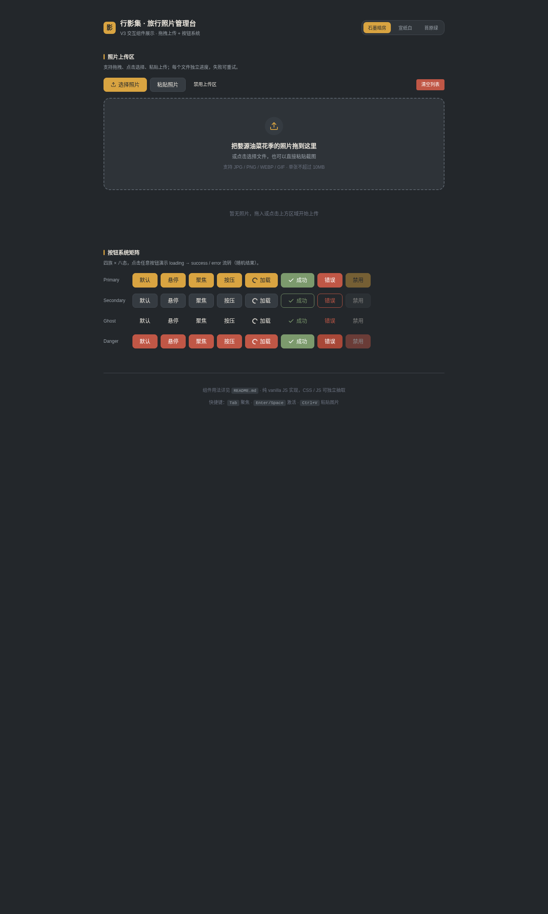

# 行影集 · 拖拽上传区与按钮系统

> V3 交互组件 · 2026-08-20
> 生产级可复用 UI 组件：**ArcUpload**（拖拽上传区，9 态状态机）+ **ArcButton**（按钮系统，4 族 × 8 态）
> 场景：「行影集」旅行照片管理台

## 预览

- 妙搭在线预览：<https://dcniaqwtmoca.feishu.cn/page/AI9gmRQS7ddevqa37cccohvAnEb>
- 截图：见同目录 `preview.png`



## 组件简介

### ArcUpload — 文件拖拽上传区
真实生产需求：表单/后台/相册类项目最高频的「上传」交互。本组件用 FileReader 真实读取用户本地图片生成缩略图（上传进度为前端模拟，可在 `simulateUpload` 内替换为真实接口）。

九态状态机：`rest / hover / focus / dragover / uploading / error / success / disabled / empty`

- 拖拽文件落入即上传；点击或 Enter/Space 打开文件选择器；Ctrl+V 粘贴图片
- 每个文件独立 determinate 进度条 + 等宽百分比
- 超过 10MB 或非图片类型 → error 卡片砖红边框 + 水平抖动 + 重试按钮
- 上传成功 → 进度条转苔绿 + 对勾描边生长
- 支持单个移除、整区禁用、清空列表（二次确认）

### ArcButton — 按钮系统
四族 × 八态：`primary / secondary / ghost / danger` × `rest / hover / focus / active / loading / success / error / disabled`

- 按压涟漪 + 下沉咬合感
- loading：spinner + 宽度锁定不跳动 + `aria-busy`
- success：spinner 收敛形变为描边对勾（苔绿）
- error：砖红 + 水平抖动
- danger 操作（清空列表）二次确认弹层
- 支持命令式 `enhance()` 与声明式 `data-arc-btn autoInit()` 两种用法

## 用法文档

### ArcUpload

```html
<div id="upload-zone" class="arc-up-zone" role="button" tabindex="0"
     aria-describedby="hint" aria-label="上传照片">
  <p class="arc-up-title">把照片拖到这里</p>
  <p class="arc-up-hint" id="hint">或点击选择，也可粘贴截图</p>
  <input type="file" class="arc-up-hidden-input" accept="image/*" multiple aria-hidden="true">
</div>
<div id="upload-list" class="arc-up-list" aria-live="polite"></div>
```

```js
const uploader = ArcUpload.init('#upload-zone', {
  accept: 'image/*',
  maxSizeMB: 10,
  multiple: true,
  simulateMs: 2000,      // 模拟上传时长（替换为真实接口时移除）
  listEl: '#upload-list',
  onAdd:    (item) => {},
  onSuccess:(item) => {},
  onError:  (item) => {},
  onRemove: (item) => {}
});

// 实例 API
uploader.setDisabled(true);   // 切换禁用态
uploader.clear();             // 清空列表
uploader.addFiles(fileArr);   // 程序化添加文件
uploader.destroy();           // 卸载，取消所有定时器/RAF
uploader.getFiles();          // 读取当前文件状态
```

> 接入真实后端：把 `simulateUpload` 内的 RAF 进度循环替换为 `fetch`/`XMLHttpRequest` 上传，在 `progress` 事件里调用 `updateProgress(id, pct)`，完成时走 success 分支即可，其余状态机无需改动。

### ArcButton

```html
<!-- 声明式 -->
<button class="arc-btn arc-btn-primary" data-arc-btn
        data-loading-text="保存中…" data-success-text="已保存">保存</button>

<!-- 直接使用类名，无需 JS 也有 hover/active/disabled/focus -->
<button class="arc-btn arc-btn-danger">删除</button>
```

```js
// 命令式
const btn = ArcButton.enhance('#my-btn', {
  loadingText: '处理中…',
  successText: '已完成',
  errorText: '失败',
  duration: 2000
});
btn.setLoading(); btn.setSuccess(); btn.setError(); btn.reset(); btn.destroy();

// 或一次性初始化所有 data-arc-btn
ArcButton.autoInit();
```

## 可配置项

### CSS 变量（37 个，换肤只需覆盖）
配色：`--arc-bg / --arc-bg-panel / --arc-bg-elevated / --arc-paper / --arc-accent(+hover/active) / --arc-success(+hover/active) / --arc-error(+hover/active) / --arc-text(+secondary/tertiary) / --arc-border(+dashed) / --arc-overlay`
形态：`--arc-radius-sm/md/lg/xl`、`--arc-shadow-sm/md/lg`、`--arc-duration-fast/base/slow`、`--arc-ease-spring/out/in-out`、`--arc-focus-ring`、`--arc-focus-offset`、`--arc-font-sans/mono`

三套预设：在 `<html>` 上设 `data-theme="paper"` 或 `data-theme="tundra"`（默认 dark 无属性）。抽到别的项目改这几个变量即可换肤。

### JS 配置
ArcUpload：`accept / maxSizeMB / multiple / simulateMs / listEl / 四个回调`
ArcButton：`loadingText / successText / errorText / duration`

## 定制方法

1. **换肤**：覆盖 `:root` 的 `--arc-*` 变量，或加 `[data-theme="xxx"]` 选择器。
2. **改圆角/阴影**：调 `--arc-radius-*` / `--arc-shadow-*`。
3. **改动效时长/曲线**：调 `--arc-duration-*` / `--arc-ease-*`（注意 success 抖动/loading 时长与语义匹配）。
4. **改上传校验规则**：`maxSizeMB` / `accept`，或扩展 `handleFiles` 内的类型判断。
5. **接真实上传接口**：替换 `simulateUpload`（见上）。

## 文件说明

- `index.html` — 单文件实现（HTML + CSS + JS），组件代码以注释块包围可整段抽取
- `设计规范.md` — 真实色值/字体/动效/状态机规范
- `preview.png` — 1440×2400 桌面截图
- `README.md` — 本文件

## 技术栈与健壮性

- 纯 vanilla，零外部依赖（无 React/Babel/CDN）
- `safeSetTimeout` / `safeRAF` + `visibilitychange` 暂停恢复
- 快速操作「先清再设」不叠加 RAF
- `prefers-reduced-motion` 降级
- 键盘可操作（Tab/Enter/Space/Esc），焦点环可见，aria-* 完整
- QA 实测：零 console Error、无横向溢出、主题切换生效、按钮 loading 流转正常
