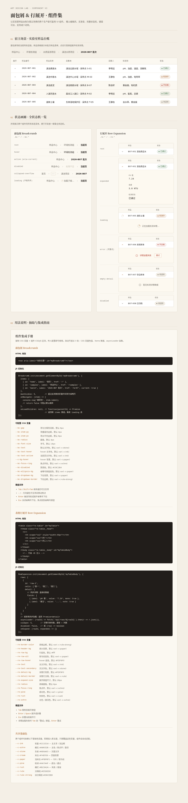

# 面包屑与行展开 · 组件集

> Art 设计实验室 · V3 交互组件 · 2026-08-20
> 两个生产级可复用 UI 组件：面包屑 Breadcrumb + 表格行展开 Row Expansion

## 主题与简介

一次产出两个真实项目中高频出现的可复用 UI 组件，以「实验室样品台账（滇池水质项目 2026-B07 批次）」为宿主场景串联演示：

- **面包屑 Breadcrumb**——层级路径导航，层级过多时中间项折叠为「···」省略号并以下拉恢复，支持异步加载子级。
- **表格行展开 Row Expansion**——点击或键盘展开某行，下方插入详情行，支持异步加载、加载失败可重试、空详情态。

二者同属表格 / 列表数据浏览语义，互补成对。展示页克制，组件是主角。

## 截图预览



## 妙搭在线预览

https://dcniaqwtmoca.feishu.cn/page/OI71mkZ9IdP5uaaiFnUcOVKZnFh

## 状态机

| 组件 | 状态 |
|---|---|
| 面包屑 | rest / hover / focus / active(当前页) / disabled / collapsed-overflow(省略号下拉) / loading |
| 行展开 | rest / hover / focus / expanding / expanded / loading / error(可重试) / empty-detail / disabled |

页面内「状态画廊」区域并排展示全部状态变体。

## 用法文档

### 1. 面包屑 Breadcrumb

HTML 骨架：
```html
<nav class="bc" aria-label="当前位置">
  <ol class="bc__list"><!-- 由 JS 渲染 --></ol>
</nav>
```

JS 初始化：
```js
Breadcrumb.mount(containerEl, {
  items: [
    { label: '样品中心', href: '#' },
    { label: '环境检测组', href: '#' },
    { label: '滇池水质项目', href: '#' },
    { label: '2026-B07 批次' }            // 最后一项为当前页
  ],
  maxVisible: 4,                           // 超出则折叠中间项为省略号
  onNavigate: function(item){ /* 跳转 */ }
});
```

键盘：`Tab` 遍历、`←/→` 项间移动、`Enter` 跳转、`Esc` 关闭省略号下拉。

### 2. 行展开 Row Expansion

HTML 骨架：
```html
<table class="re-table" aria-label="样品台账">
  <thead><tr><th></th><th>编号</th>...</tr></thead>
  <tbody><!-- 由 JS 渲染 --></tbody>
</table>
```

JS 初始化：
```js
RowExpansion.mount(tbodyEl, {
  rows: [
    { id: 'YP-2026-B07-001', cells: [...], detail: { async: true } }
  ],
  colSpan: 6,
  asyncLoader: function(rowId, row){
    return fetch('/api/detail/'+rowId).then(r=>r.json());  // 返回 { fields: [...] }
  },
  onExpand: function(rowId, expanded){ /* 回调 */ }
});
```

键盘：`Tab` 聚焦展开按钮、`Enter/Space` 展开 / 折叠、`Esc` 折叠。

## 可配置项（CSS 变量）

共享基础色（`--c-*`）：
```css
:root{
  --c-ink:#211D1A; --c-ochre:#A8632B; --c-stone:#6E6A63;
  --c-cream:#F4EFE6; --c-paper:#FBF8F1;
  --c-pine:#4A7A4F; --c-rust:#B23A2A;
  --c-rule:#E5DED0; --c-rule-strong:#D6CEBD;
  --font-serif:"Source Han Serif SC",...;
  --font-sans:"PingFang SC",...;
  --font-mono:"JetBrains Mono",...;
}
```

面包屑（`--bc-*`）：`--bc-gap` `--bc-item-px/py` `--bc-radius` `--bc-font-size` `--bc-focus-ring` `--bc-disabled` `--bc-dropdown-bg` `--bc-dropdown-border` `--bc-ellipsis-bg` 等。

行展开（`--re-*`）：`--re-border-color` `--re-header-bg` `--re-row-bg` `--re-row-alt` `--re-row-hover` `--re-row-focus` `--re-detail-bg` `--re-expand-size` `--re-radius` `--re-focus-ring` 等。

**定制方法**：接入新主题只需覆盖上述 CSS 变量色值；改 JS 传 `items` 数据与 `asyncLoader` 函数即可适配业务。改动不超过 3 处。

## 文件说明

| 文件 | 说明 |
|---|---|
| `index.html` | 单文件应用，含两个组件的全部 HTML / CSS / JS（组件 CSS/JS 有注释边界，可独立抽取） |
| `preview.png` | 桌面端 1280 宽全页截图 |
| `设计规范.md` | 色彩 / 字体 / 动效 / 状态机 / 可访问性规范 |
| `README.md` | 本文件 |

## 技术栈

纯 vanilla HTML + CSS + JS，零 React / Babel / CDN / 外部资源。支持 `prefers-reduced-motion`、`visibilitychange` 暂停定时器、完整 ARIA、键盘可操作。

## 自检结论

- 删除所有动画后，两组件仍完整可用（`prefers-reduced-motion` 已验证降级）。
- 抽到别的项目改不超过 3 处（CSS 变量 + items + asyncLoader）即可用。
- Browser QA：零 console / page error、零失败请求、桌面无溢出；窄屏 390 表格可横向滚动（符合设定）。
- Critic：契约保真 FULL，无 CRITICAL / MAJOR；唯一 MINOR 为窄屏 38px 横向溢出（属"窄屏表格可横向滚动"允许范围）。
- Quality Gate：PASS（Utility 18/20、State 17/20、Feel 13/15、Reusability 13/15、Technical 9/10，CRITICAL=0）。

> 等待协调者检查后提交 GitHub。
