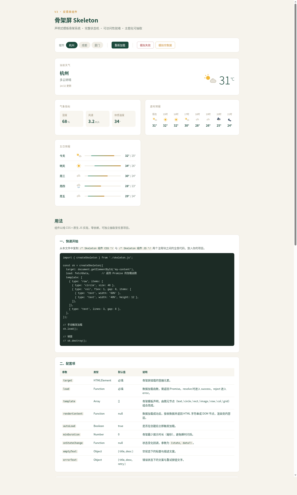

# 骨架屏 Skeleton · 异步加载反馈组件

> 2026-08-20 · V3 实用可复用 UI 组件 · 反馈类

## 简介

生产级**骨架屏组件**：用声明式模板图元拼出任意布局的加载占位，驱动 loading → success / error / empty 完整异步流转，自带 shimmer 扫光、状态播报与可重试。把它包在任何异步区块外层、传入数据 Promise 即可获得完整加载体验。

演示场景为**中文城市天气面板**（杭州 / 成都 / 厦门可切换），用主卡、指标网格、逐时条、五日列表四种布局验证骨架模板的表达力。控制台可「重新加载 / 模拟失败 / 模拟空数据」真实驱动状态流转。



**妙搭预览**：https://dcniaqwtmoca.feishu.cn/page/NL6QmRUoJdEsD1asdMIcAJjXnme

## 用法

```js
const sk = createSkeleton({
  target: document.getElementById('weather'),
  template: { type: 'col', children: [
    { type: 'row', children: [
      { type: 'circle', size: 48 },
      { type: 'col', flex: 1, gap: 8, children: [
        { type: 'text', width: '60%' },
        { type: 'text', width: '40%' },
      ]}
    ]},
    { type: 'grid', cols: 3, rows: 1, height: 56 },
  ]},
  load: () => fetchWeather('杭州'),   // 返回 Promise
  onStateChange: (state) => console.log(state),
});
// sk.load() / sk.setState('error') / sk.getState() / sk.destroy()
```

## 图元类型

| 图元 | 说明 |
|---|---|
| `text` | 文本行（可设 width 比例） |
| `circle` | 圆形（头像/图标占位，size） |
| `rect` | 矩形块 |
| `image` | 图像块 |
| `row` / `col` | 行/列容器（可嵌套、可设 flex/gap） |
| `grid` | 网格（cols/rows/height） |

## 可配置项（主题变量）

共 20 个 `--sk-*` CSS 变量，覆盖颜色 / 圆角 / 间距 / 时长。常用：

- `--sk-base` 骨架基色、`--sk-shine` 扫光高亮、`--sk-bg` 底色
- `--sk-fg` 主色、`--sk-accent` 点缀、`--sk-error` 错误色
- `--sk-radius` / `--sk-gap` / `--sk-text-h`
- `--sk-duration`（1.6s）/ `--sk-easing`（linear）/ `--sk-fade`（260ms）

改主题只需在容器上覆盖这几个变量即可。完整清单见 `设计规范.md`。

## 定制方法

1. **换主题**：在目标容器 `style` 或父级 class 覆盖 `--sk-fg` / `--sk-accent` / `--sk-base` 等。
2. **换动效**：调 `--sk-duration`（扫光速度）、`--sk-fade`（淡入时长）。
3. **抽取复用**：源码中以 `<!-- ===== Skeleton 组件 CSS ===== -->` / `<!-- ===== Skeleton 组件 JS ===== -->` 注释标出边界，复制对应区块到自己项目，改不超过 3 处即可用。

## 状态

loading → success / error（可重试）/ empty，覆盖 hover / focus / active / disabled（≥8 态）。`role="status"` + `aria-live` 播报，`aria-busy` 标记，重试按钮键盘可达、自动聚焦，`prefers-reduced-motion` 降级。

## 文件说明

- `index.html` — 单文件完整组件 + 天气面板演示 + 用法文档
- `preview.png` — 浏览器渲染截图
- `设计规范.md` — 色值 / 字体 / 动效 / 状态机规范

## 技术栈

纯 vanilla HTML + CSS + JS，无 React / Babel / 任何 CDN / 外部字体 / 外部图片。零未定义引用，Console 无 Error。

---

等待协调者检查后提交 GitHub。
